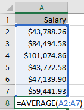
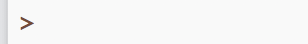
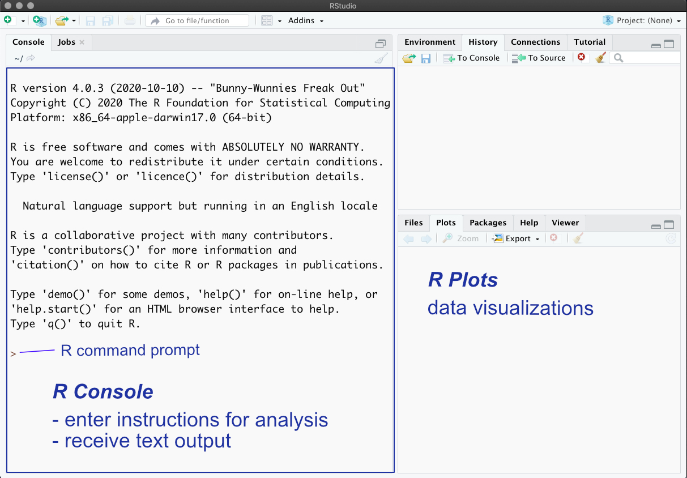

# R {#sec-R-intro}

```{r}
#| output: false
#| echo: false
library(tufte) 
library("lessR")
library("datasets")
```

`r newthought("Data analytics is a fast-developing, exciting topic of research and application that impacts many areas of our lives.")` We are today experiencing an authentic knowledge revolution that integrates the statistical analysis of data using computers. Here you are introduced to data analytics. After you spend a few hours learning the basics of the R software system for analytics, the rest is straightforward. From a small investment in learning how the system works, you gain access to much data analytic prowess using one of the primary languages of modern data science.

# Overview

`r newthought("We begin with some basic concepts of data analytics.")` All data analysis, as in 100%, is done on the computer. We use R [@R] as the app for data analytics, the same analysis system that many data scientists use to do real data science throughout the world.

Following a general explanation of how R works, find some instructions on how to accomplish some basic tasks. Work through the following content step-by-step. Each step is straightforward. Skipping steps or skimming the content, however, leads to nowhere except confusion.

::: {.callout-tip title="Practice as you go"}
As you proceed, follow along with your computer, actively running each example, guided by the written material and the linked videos.
:::

Get the basics down, and the rest readily follows.

## R vs. Excel {#RvsExcel}

`r newthought("Excel and R analyze data with functions.")` You already know more about using R than you thought you did. Excel implements many built-in functions, plus user-defined functions (which Excel calls macros), and so does R.

::: {.callout-note title="Function"}
A set of instructions to perform the computations that transform data values into results, the output of the analysis.
:::

The input into a data analysis function is data. The output of a function can assume several forms:

- text in the form of writing and tables
- visualizations in a graphics format such as *pdf* or *png*
- data transformed from the original input data.

To run an R program is to process the code, a sequence of function calls that perform the analyses.

### Function Calls {#functions}



`r newthought("R and Excel differ on how to instruct a function to do its work.")` To illustrate, consider the following six data values: the annual salaries of six employees at a company. According to the standard organization of data, find the variable name *Salary* in the first row of the Excel worksheet. The data values follow in the same column under the variable name.

What is the average salary? Compute the average, more technically called the (arithmetic) mean, either with the Excel function `average()` or with the R function `mean()`. Both functions provide the same result, but the respective languages name their functions differently.

::: {.callout-note title="Function call"}
Computer instruction to process the computations of a function from within a data analysis system such as Excel or R.
:::

*Excel function call*. Enter the function call into a cell in the worksheet, using the same type of storage area (a worksheet cell) as the data values.

In this example, enter the function call beneath the column of data into the 8th cell in Column A. Specify the data for analysis with a *cell range*, such as the relative cell range A2:A7. This cell range refers to cells in the same column as the cell containing the function call. This cell range extends from the cell in the second row of Column A to the cell in the seventh row.

*R function call*. R works differently from a worksheet app. R processes the analysis instructions line-by-line in an area separate from the data, called the *R console*. Each line is called a *command line*, which contains a prompt, a `>`, for entering a command, that is, an R instruction.

::: {.callout-tip title="R prompt"}
At the `>` prompt in the R console, enter the name of the function designed to accomplish that analysis with the variable(s) to be analyzed, followed by Enter/Return.
:::

@fig-cmnd shows the R prompt for one line in the R console.

{#fig-cmnd width=25% fig-align="left" fig-alt="R command line prompt."}

Each function has a name, such as `X()` to display a distribution of a continuous variable along the $x$-axis, by default, a histogram and related summary statistics such as the mean. The `()` indicates that the reference is to a function, which is where various values, such as a variable name, are passed to the function. To call a function for data analysis, in response to the R command prompt, `>`, enter the function name, a left parenthesis, usually at least one value such as the variable name for which to do the analysis, and then a matching right parenthesis.

The example in @fig-hprmt creates the [histogram](#hist) of variable *Salary*, as well as summary statistics that include the mean, by calling the `X()` function for the variable *Salary*.

{#fig-hprmt width=14% fig-align="left" fig-alt="Function call entered at the command prompt."}

Data easily flows from an Excel worksheet into R. To begin this analysis, [read](#read) the Excel worksheet that includes a variable named *Salary* into R from a simple instruction you enter at the command line.

That is it. To get the histogram, mean, and more of the variable Salary after reading the data into R, at the `>` prompt enter the function call `X(Salary)`. To analyze the data values for a variable in R, refer to the variable's name within the parentheses. Be aware of the exact spelling of the variable names, including capitalization, in this case, beginning the function reference with an uppercase X.

As with the Excel example, this histogram analysis with R requires *no programming*. The programming was done by the people who wrote the functions referenced in the analysis. Instead of potentially writing complicated computer code, enter a simple function call to analyze the data. In this example, the R function did much more than compute a simple mean. Just getting the histogram and the associated statistics with Excel involves more work.

We have seen that both Excel and R analyze the data values for a variable organized within a column, though with different user interfaces. R, however, presents several advantages.

## Advantages of R

`r newthought("Data scientists use R (or similar languages) for their analyses")` instead of Excel. Some reasons for the preference for R and related languages follow.

<ul style="list-style-type: disc;">

<li>Excel is great for data entry and viewing data as a spreadsheet app, but it provides only the most basic statistical computations. Excel is *not* a serious app for data analysis.</li>

<li>Once the concept of working with R is understood, less work is required to conduct an analysis, even directly from Excel data, such as simply entering `X(Salary)`, than can be obtained with the more cumbersome set of procedures offered by Excel.</li>

<li>R does Big Data, efficiently handling data sets with millions of rows of data, limited only by the computer's available memory.</li>

<li>R separates the instructions for the analysis of data from the data. This separation makes debugging errors much more straightforward than in Excel files, which can include multiple, linked worksheets that can more easily hide errors.</li>

<li>Obtain each R analysis with one or more instructions, function calls, that can be saved for future use instead of irrecoverable mouse clicks. The results of R analyses are <i>reproducible</i>.</li>

</ul>

The multiple instructions to perform an R analysis precisely document how to conduct the analysis. As shown later, save these instructions in a file for later use to repeat the analysis.

::: {.callout-note title="Reproducibility"}
Analyses can be re-run in the future to reproduce previously obtained results.
:::

The analyst typically does not enter code directly into R at the command prompt. Instead, write the R instructions into a simple text file that can be retrieved and re-run at any time. Saving the R code allows for reproducible analysis. The instructions for analyses performed by one person become accessible to all members of your organization who have access to the file, including yourself, at any time. On the contrary, those Excel mouse clicks vanish into digital dust.

As I wrote in the *Journal of Statistics and Data Science Education* [@GerbR]:

::: {.callout-tip title="Separate your data from the code"}
From a data science perspective, Excel worksheets exhibit a fundamental flaw: the confounding of data with the instructions for processing it. Both the data and the data processing instructions are entered into adjacent cells within the same worksheet. On the contrary, R and related analysis systems store data and processing instructions in separate files (p. 251).
:::

Countless overly complex Excel worksheets that model business processes are horrendous to debug and understand. Let the (moderate size) data reside within Excel, but use R or a similar language to write your code that manipulates and analyzes your data. If needed, export the results of your specified computations back to Excel. R writes data to Excel files as easily as it reads data from Excel worksheets.

Separate your data from your code to process that data. Programming languages for data analysis, such as R, provide that separation. In my opinion, Excel is vastly overused to the extent that it becomes a detriment to many business operations. Welcome, instead, to the world of data science.

## RStudio {#getRStudio}

`r newthought("Most analysts who use R run R from within an app called RStudio")` because of the additional features that RStudio provides. From RStudio, you are running R at the standard R command line from what is called the R console, but within the RStudio environment.

::: column-margin
RStudio (and the related Positron) does more than run R data analyses. It also runs Python and other data analysis languages. It also serves as the basis for writing standard documents in the Quarto Markdown language, such as the document you are now reading.
:::

As shown in @fig-RStudio, the RStudio window consists of several resizable window panes. The primary window pane is the standard R console, the same console available from running R by itself. The bottom-right window pane with the `Plots` tab is where RStudio displays data visualizations and can also display other information, such as your file directory. The top-right window pane displays information such as your `History` of entered R instructions.

{#fig-RStudio width=98% fig-align="center" fig-alt="RStudio window panes."}

R processes all instructions at the command prompt in the R console window pane. One option directly enters the instructions at the command prompt. The shortcoming of this approach is that the instructions must be re-entered every time the analysis is re-run. To enable reproducibility when storing R code, add a fourth window pane in the top-left corner, labeled `Script Files`, in @fig-RStudio. Create a new R script file with the following menu sequence:

```         
File menu --> New File --> R Script
```

Enter R instructions into the script window, select one or more instructions, and press the `Run` button at the top-right of the window pane. RStudio will copy the selected information to the command prompt and run the instructions as if you had entered them directly into the console. Save the file of the R script so that you can provide for reproducing or extending the analysis without having to re-type everything.

# Getting Started {#start}

Running R on your computer requires first downloading the R app, and usually the RStudio app as well. 

- <a href="https://cran.rstudio.com" target="_blank" rel="noopener">R</a>
- <a href="https://docs.posit.co/ide/user/#direct-downloads-open-source" target="_blank" rel="noopener">RStudio</a>

When installing R, choose your operating system from the links at the top of the corresponding web page. For *Windows*, the top of the resulting web page has the download link. For *Mac*, several paragraphs down, in the left margin, you have a choice. The first link in the margin is for `For Apple silicon (M1-3) Macs`, the version for the more recently developed Apple M series processors. A second link, further down the margin, is `For older Intel Macs`. If you are not sure of your CPU type, go to the first choice under the Apple menu, About this Mac, and look at the information for `Chip`.

If you are asked the question, *Install in a personal library?* answer `y` for yes (unless you understand administrative privileges). The installer offers both 32-bit and 64-bit versions. Unless your computer is from around 2012 or earlier, run 64-bit software as you would any other app.

Once R and RStudio are downloaded, their installations proceed as with any app. Accept the given defaults for each step of the process. After installation, run R as you would any other application, such as by double-clicking its icon in your file system. Usually, however, run the RStudio app, which then automatically connects to and runs R in the RStudio environment.

## `lessR` Enhancements {#lessR}

### Ungeek

`r newthought("Standard R is for geeks.")` R analyses typically involve writing programming code well beyond just a few function calls. I have made R for basic data analysis more straightforward with my 45 or so functions that complement the standard R functions, such as my `Chart()` function. These functions, and the more extensive and helpful error diagnostics they provide, result in a more or less "un-geeked" R. The set of these functions are included in the package called `lessR`, the basis for my article in the *Journal of Statistics and Data Science Education*, @GerbR, and book, @gerbing23.

::: {.callout-tip title="No programming involved"}
`lessR` function calls are straightforward -- only function calls, no programming required to obtain comprehensive results.
:::

### Download and Install

`lessR` organizes functions into what the R ecosystem calls a package. The full R ecosystem, available on servers worldwide, consists of hundreds of base (standard) R functions included with R, plus functions from additional packages that meet strict requirements before being published on the R servers. Downloading R installs all the base R functions. Separately download packages such as `lessR` to access additional functions, all accessed via the standard R environment.

Running R, within RStudio or by itself, on either your computer or in the cloud, one time only, download the `lessR` package of functions (and associated dependent packages) from the worldwide network of R servers. At the R console command prompt, `>`, enter the following instruction (function call) into the R console, then press Enter/Return.

[Video]{.vid}: <a href="https://media.pdx.edu/media/t/1_as8dy1xh" target="_blank" rel="noopener noreferrer">install lessR</a> \[1:28\]

```{r install, eval=FALSE, echo=TRUE}
install.packages("lessR")
```

This installation process involves not only downloading the `lessR` functions, but also many packages on which `lessR` depends. The entire process takes some seconds to a minute or so, depending on the speed of your Internet connection.

### Potential Issues

<p style="padding: 0;">

[➝]{style="font-size: 1.25em;"} If asked the following question about compilation, answer `no`.

```         
Do you want to install from sources the package that
   needs compilation? (Yes/no/cancel)
```

<p style="padding: 0;">

[➝]{style="font-size: 1.25em;"} When you install lessR you may get the following warning, which will be misleading for most people who use R.

```         
> install.packages("lessR")
WARNING: Rtools is required to build R packages, but is not currently 
installed. Please download and install the appropriate version of Rtools
before proceeding:

https://cran.rstudio.com/bin/windows/Rtools/
```

That message is for people who want to work with R at a much deeper level than the typical user. You likely have no desire to ever "build" an R package, which means compiling R source code into a ready-to-run Windows, Mac, or Linux/Unix binary. Feel free to ignore the warning, as `lessR` and its dependent packages have already been built for you.

<p style="padding: 0;">

[➝]{style="font-size: 1.25em;"} On some occasions, one of the additional packages upon which `lessR` depends does not get downloaded. Then, when you try to access `lessR` as shown below, you get a message that `lessR` cannot be accessed because of a missing package.

The response to that system error is to install the missing package using the same `install.packages()` function you used to install `lessR`.

### Access `lessR`

Once downloaded, R stores the `lessR` functions in your R library created for you during the installation process. To access these functions for a specific R session, retrieve them from the library.

::: {.callout-tip title="Begin each session with `library(lessR)`"}
At the beginning of <i>every</i> R session, first invoke the R function call `library(lessR)` that retrieves the <b>lessR</b> functions from your library for data analysis.
:::

::: {.callout-tip title="Quotes or no quotes?"}
The `library()` function is one of the few places in R where it makes no difference if you enclose the package name in quotes. Both `library(lessR)` and `library("lessR")` work, so you may see that function illustrated either way in various examples.
:::

[Video]{.vid}: <a href="https://media.pdx.edu/media/t/1_jom6shh9" target="_blank" rel="noopener noreferrer">library(lessR)</a> \[1:04\]

```{r library, echo=TRUE}
library(lessR)
```

Does it work? If the `lessR` functions successfully load from your R library, the following appears, including instructions for getting started with R and `lessR`. These instructions include how to read data from files on your computer system into R for analysis and how to access [examples](#vig) of various analyses.

```         
lessR 4.5.7                          feedback: gerbing@pdx.edu 
--------------------------------------------------------------
d <- Read("")  Read data file, many formats available, e.g., Excel
d is the default data frame, data= in analysis routines optional

Find many examples for visualization, models, and general analysis.
  Enter: browseVignettes("lessR")  or  news(package="lessR")

Visualize your data.
  Chart(): form = "bar", "pie", "radar", "bubble", "dot",
                  "sunburst", "treemap", "icicle", "profile" 
  X(): form="histogram", "freq_poly", "density", "vbs", and more
  XY(): form="scatter", "contour", "smooth", "hexbin", "sunflower" 
More info, enter: ?Chart, ?X, or ?XY + ?Flows for Sankey diagrams.

Interactive data analysis for constructing visualizations.
  Enter: interact()
```

Occasionally, update your R packages. To update, enter:

`update.packages(ask=FALSE)`

This instruction updates `lessR` as well as the packages upon which `lessR` depends, and any other packages you may have installed. Or, if using RStudio, from the `Tools` menu, you can also select `Check for Package Updates...`.\`\`\`
